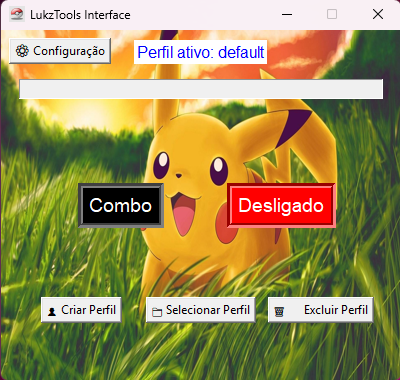
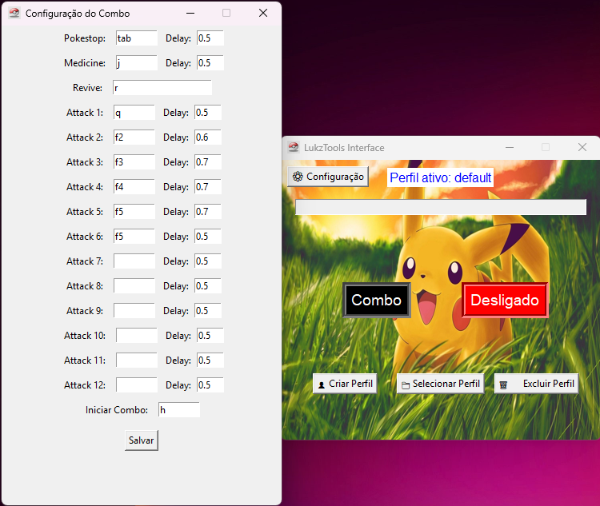
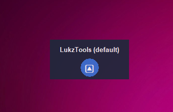
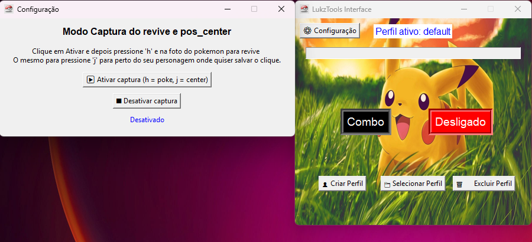

# 🎮 LukzTools - Automação de Combos
Uma ferramenta de automação com interface gráfica (GUI) construída em Python usando Tkinter. O LukzTools permite que usuários configurem e executem sequências de teclas (combos) em jogos ou outras aplicações, com suporte a perfis, delays customizáveis e um overlay para fácil acesso.


## 📷 Screenshots

| Janela Principal | Configuração do Combo | Mini Overlay |
| :---: |:---:|:---:|
|  |  |  |

## 🚀 Funcionalidades

Interface Gráfica Intuitiva: Fácil de configurar através de uma interface visual, sem necessidade de editar código.

Combos 100% Configuráveis: Defina até 12 teclas de ataque, cada uma com seu próprio delay em segundos.

Gerenciamento de Perfis: Crie, salve, selecione e exclua perfis diferentes. Ideal para configurar o bot para diferentes personagens ou situações de jogo.

Captura de Coordenadas: Um modo de configuração especial permite capturar coordenadas precisas do mouse para ações específicas, como o "revive".

Atalho de Ativação: Defina uma tecla de atalho global para iniciar o combo, que só funcionará quando a ferramenta estiver "Ativada".

Mini Overlay: Minimize a aplicação para um pequeno overlay que fica sempre visível, permitindo reabrir a janela principal com um clique, sem poluir a tela.

## 🛠️ Tecnologias utilizadas
- [Python](https://www.python.org/)  
- [Tkinter](https://docs.python.org/3/library/tkinter.html) - Interface gráfica  
- [Keyboard](https://pypi.org/project/keyboard/) - Leitura e simulação de teclas  
- [PyAutoGUI](https://pypi.org/project/pyautogui/) - Automação de cliques  
- [Pillow](https://pypi.org/project/Pillow/) - Manipulação de imagens na interface  
- JSON - Armazenamento de perfis

## ⚙️ Como Funciona
A aplicação utiliza as bibliotecas keyboard para simular o pressionamento de teclas e pyautogui para controlar o mouse. A interface, construída com tkinter, permite que o usuário defina todas as teclas e delays, que são salvos em um arquivo perfis.json. Ao ativar a ferramenta, ela escuta pela "tecla de início de combo" e, quando pressionada, executa a sequência de ações pré-configurada.

## 🚀 Instalação e Execução
Para rodar este projeto, você precisará ter o Python 3 instalado.

🔧 Instalação Clone o repositório:


1. Clone este repositório ou faça o download dos arquivos:

```bash
git clone https://github.com/SEU-USUARIO/LukzTools.git
cd LukzTools

Instale as dependências:
keyboard
pyautogui
Pillow

▶️ Como Executar
Depois de concluir a instalação, você pode iniciar o programa com o seguinte comando:
python main.py
```
📋 Como Usar
Primeira Execução (Configuração de Posição):

Abra o programa.
```bash
python main.py
```

## Clique no botão "⚙ Configuração".


Clique em "▶ Ativar captura".

Volte para o seu jogo. Coloque o cursor do mouse sobre a imagem do seu pokémon (para o revive) e pressione a tecla **`H`**

Coloque o cursor no centro da tela (ou perto do seu personagem) e pressione a tecla **`J`**

Clique em "■ Desativar captura" na janela de configuração.


## 👤 Salvando seu Perfil

1. Na janela principal, clique em **"👤 Criar Perfil"**.  
2. Dê um nome ao seu perfil (ex: `Meu Paladino`) e clique em **"Criar"**.  
3. Suas configurações de combo atuais serão salvas nele.

---

## 🎛️ Configurando seu Combo

1. Na janela principal, clique no botão **"Combo"**.  
2. Preencha os campos com as teclas que você usa no jogo (ex: `F1`, `F2`, `Page Down`) e os **delays** desejados entre cada ação (ex: `0.5` para meio segundo).  
3. Defina a tecla que irá iniciar todo o combo no campo **`"Iniciar Combo"`**.  
4. Clique em **"Salvar"**.

---

## 🔛 Ativando a Ferramenta

1. Clique no botão **"Desligado"** para que ele fique **verde** e mude para **"Ativado"**.

---

## 🎮 Executando no Jogo

1. Com a ferramenta **Ativada**, vá para o jogo.  
2. Pressione a tecla que você definiu como **`"Iniciar Combo"`**.  
3. A sequência de ataques e ações será executada automaticamente.

---

⚠️ **Aviso Importante**  
O uso de ferramentas de automação pode ser contra os **Termos de Serviço** de muitos jogos online e pode resultar em **punições para sua conta**.  
Use esta ferramenta **por sua conta e risco**.  
O desenvolvedor **não se responsabiliza** por qualquer consequência negativa do seu uso.

